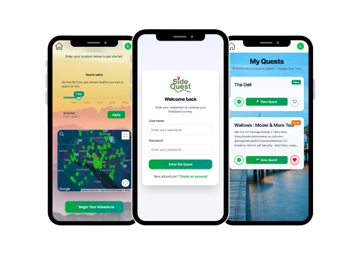
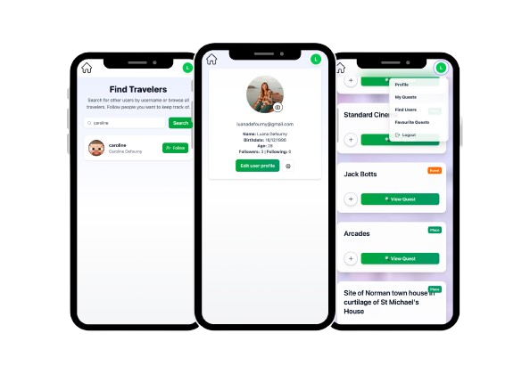

# SideQuest

<p align="center">
  
</p>

> SideQuest is a mobile-first web application aimed at providing location-based micro-adventures. It is a tool for finding something to do when you are uninspired or simply bored and want to explore new places and events in your area. It uses geo-location or user input to determine a local radius and provides a list of quests to the user.

[Deployed version](https://sidequest-app.vercel.app)

## Screenshots

<p align="center">
  
</p>

<p align="center">
  
</p>

## Getting started
1. Clone the [SideQuest](https://github.com/luanadefourny/sidequest) repository

2. Install dependencies

```
npm install
cd server
npm install
cd ../client
npm install
```

3. Add environment variables

- Create a `.env` file (based on the `.env.example` file)
- Copy the `.env.example` file to `.env` (server)
  ```
  cp .env.example .env
  ```

4. Run the app

```
npm run dev
cd ../server
npm run dev
```

5. Login with your user details or Create an account and you're all set to use the app!

## Tech Stack

* TypeScript
* React
* Express
* MongoDB (Mongoose)
* Tailwind CSS

## Developers

* Luana Defourny - [GitHub](https://github.com/luanadefourny) - [LinkedIn](https://www.linkedin.com/in/luanadefourny/)
* Mihai Serban - [GitHub](https://github.com/Mihai-George-Serban) - [LinkedIn](https://www.linkedin.com/in/mihai-george-serban/)
* Patrik Gjika - [GitHub](https://github.com/drtiku4) - [LinkedIn](https://www.linkedin.com/in/patrik-gjika-data-analyst-/)
* Theo Crewe-Read - [GitHub](https://github.com/theocr301) - [LinkedIn](https://www.linkedin.com/in/theo-crewe-read-866998242/)
